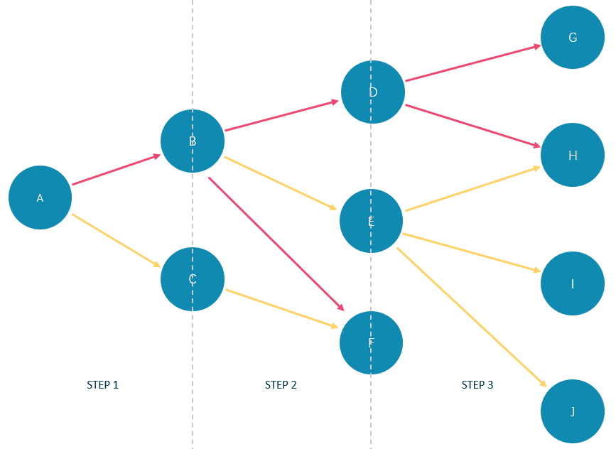

# SAMPLE

`SAMPLE`子句用于在结果集中均匀取样并返回指定数量的数据。

`SAMPLE`仅能在`GO`语句中使用，语法如下：

```ngql
<go_statement> SAMPLE <sample_list>;
```

`sample_list`是一个列表，列表中的元素必须为自然数，且元素数量必须与`GO`语句中的`STEPS`的最大数相同。下文以`GO 1 TO 3 STEPS FROM "A" OVER * SAMPLE <sample_list>`为例详细介绍`SAMPLE`的用法。

* 列表`sample_list`必须包含 3 个自然数元素，例如`GO 1 TO 3 STEPS FROM "A" OVER * SAMPLE [1,2,4]`。
* `SAMPLE [1,2,4]`中的`1`表示系统在第一步时自动选择 1 条边继续遍历，`2`表示在第二步时选择 2 条边继续遍历，`4`表示在第三步时选择 4 条边继续遍历。如果某一步没有匹配的边或者匹配到的边数量小于指定数量，则按实际数量返回。
* 因为`GO 1 TO 3 STEPS`表示返回第一到第三步的所有遍历结果，因此下图中所有红色边和它们的原点与目的点都会被这条`GO`语句匹配上，而黄色边表示`GO`语句遍历时没有选择的路径。如果不是`GO 1 TO 3 STEPS`而是`GO 3 STEPS`，则只会匹配上第三步的红色边和它们两端的点。



在 basketballplayer 数据集中的执行示例如下：

```ngql
nebula> GO 3 STEPS FROM "player100" \
        OVER * \
        YIELD properties($$).name AS NAME, properties($$).age AS Age \
        SAMPLE [1,2,3];
+-----------------+--------------+
| NAME            | Age          |
+-----------------+--------------+
| "Spurs"         | UNKNOWN_PROP |
| "Tony Parker"   | 36           |
| "Manu Ginobili" | 41           |
+-----------------+--------------+

nebula> GO 1 TO 3 STEPS FROM "player100" \
        OVER * \
        YIELD properties($$).name AS NAME, properties($$).age AS Age \
        SAMPLE [2,2,2];
+---------------------+-----+
| NAME                | Age |
+---------------------+-----+
| "Manu Ginobili"     | 41  |
| "Tony Parker"       | 36  |
| "Tim Duncan"        | 42  |
| "LaMarcus Aldridge" | 33  |
| "Tony Parker"       | 36  |
| "Tim Duncan"        | 42  |
+---------------------+-----+
```
